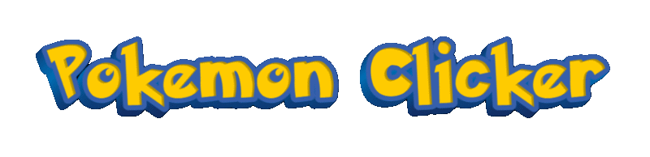
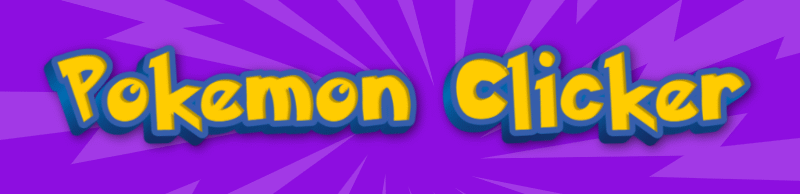

<div align="center">
    
</div>

# 🎮 Pokemon Clicker Battle v0.0.6

Добро пожаловать в мир Pokemon Clicker Battle — захватывающей инкрементальной игры, где вы становитесь тренером покемонов, сражаетесь с противниками, собираете коллекцию, путешествуете по регионам и развиваете свою команду!


## 🎯 Основные возможности (v0.0.6)

### ✨ Новое в версии 0.0.6:

| Герои | Система прокачки |
|-----------------------|---------------------|
|  |  |

| Ловля | Развитие |
|-----------------------|---------------------|
|  |  |

| Враги | Приключения |
|-----------------------|---------------------|
|  |  |

| Команда | Коллекция |
|-----------------------|---------------------|
|  |  |

| Задания | Магазин |
|-----------------------|---------------------|
|  |  |

| Турниры | Охота |
|-----------------------|---------------------|
|  |  |

### ✅ Реализовано в версии 0.0.6:

#### 🎮 **Игровые системы:**
- **Боевая система** - Динамические сражения с противниками
- **Система уровней врагов** - Враги масштабируются относительно игрока
- **Локации и карта** - Путешествие по региону Канто
- **Система арен** - 8 уникальных арен с лидерами
- **Покемон-центры** - Восстановление энергии покемонов
- **Система квестов** - Ежедневные задания в локациях
- **Коллекция покемонов** - 50+ покемонов для сбора
- **Система команд** - Формирование команды до 3 покемонов

#### 👤 **Система героев:**
- **Выбор героя** - Эш, Мисти или Брок
- **Уникальные бонусы** - Каждый герой дает особые преимущества
- **Любимые покемоны** - +50% урона для избранных
- **Прогрессия героя** - Повышение уровня через опыт
- **Дерево улучшений** - 20+ уникальных улучшений на выбор

#### 💼 **Экономика и магазин:**
- **Поке-баксы** - Игровая валюта
- **Покеболы** - 3 типа с разными шансами выпадения
- **Система редкостей** - От обычных до легендарных
- **Ограничения по уровню** - Редкие покемоны открываются с прогрессом

#### 🎨 **Визуальные эффекты:**
- **Анимации слияния** - Эффектное повышение уровня покемонов
- **Эффекты урона** - Критические удары с подсветкой
- **Анимации открытия покеболов** - Захватывающие моменты получения
- **Интерактивный интерфейс** - Плавные переходы и hover-эффекты

#### 💾 **Сохранение и прогресс:**
- **Автосохранение** - Каждые 30 секунд
- **Множество слотов** - Раздельное сохранение разных систем
- **Загрузка прогресса** - При возвращении в игру

#### 📱 **Адаптивность:**
- **Поддержка мобильных** - Оптимизация под все экраны
- **Сенсорное управление** - Удобные кнопки для тапов
- **Адаптивный интерфейс** - Элементы подстраиваются под размер

## 🎮 Игровой процесс:

### 1. **Начало приключения**
   - Выберите своего первого героя
   - Получите стартового покемона
   - Пройдите обучение

### 2. **Путешествие по карте**
   - Исследуйте регион Канто
   - Открывайте новые локации
   - В каждой локации свои покемоны

### 3. **Сражения**
   - Кликайте по врагу для атаки
   - Собирайте команду из 3 покемонов
   - Используйте авто-атаку при полной команде
   - Получайте награды за победы

### 4. **Развитие**
   - Собирайте одинаковых покемонов для слияния
   - Повышайте уровень и урон
   - Прокачивайте героя и открывайте улучшения
   - Побеждайте лидеров арен

### 5. **Коллекционирование**
   - Открывайте покеболы
   - Собирайте всех 50+ покемонов
   - Следите за редкостью в коллекции
   - Хвастайтесь легендарными

## 🛠 Технические особенности

### Архитектура:
- **Модульная структура** - 15+ независимых систем
- **ООП подход** - Классы для каждой игровой системы
- **Event-driven** - Событийная модель взаимодействия
- **Singleton паттерны** - Для глобальных менеджеров

### Системы игры:
1. **SaveManager** - Управление сохранениями
2. **PokemonManager** - Работа с покемонами
3. **BattleSystem** - Боевая механика
4. **ShopSystem** - Торговля и экономика
5. **UIManager** - Управление интерфейсом
6. **AnimationManager** - Визуальные эффекты
7. **TutorialSystem** - Обучение игрока
8. **LocationSystem** - Локации и карта
9. **HeroSystem** - Герои и улучшения
10. **GymSystem** - Арены и битвы
11. **PokemonCenter** - Лечение покемонов
12. **QuestsPanel** - Ежедневные задания
13. **MapModal** - Интерактивная карта
14. **ImageManager** - Загрузка и кэширование изображений
15. **SoundGenerator** - Звуковые эффекты

### Технологии:
- **Чистый JavaScript** (ES6+) с современными возможностями
- **HTML5** с семантической разметкой
- **CSS3** с Flexbox/Grid и CSS-переменными
- **LocalStorage** для сохранения прогресса
- **Font Awesome 6** для иконок
- **CSS-анимации** и ключевые кадры
- **Canvas API** для интерактивной карты
- **Async/Await** для асинхронных операций

### Производительность:
- **Кэширование изображений** - Быстрая загрузка
- **Ленивая инициализация** - Системы загружаются по мере необходимости
- **Оптимизация ререндеров** - Минимизация обновлений DOM
- **Debounced события** - Для плавной работы на мобильных

## 📦 Структура проекта

```
pokemon-clicker/
├── index.html              # Основной HTML файл
├── style.css               # Стили игры
├── images/                  # Изображения
│   ├── logo/               # Логотипы
│   └── screens/            # Скриншоты
├── config.js               # Основная конфигурация
├── image-config.js         # Конфигурация изображений
├── image-loader.js         # Загрузчик изображений
├── save-manager.js         # Управление сохранениями
├── pokemon-manager.js      # Управление покемонами
├── shop-system.js          # Магазин и экономика
├── battle-system.js        # Боевая система
├── location-system.js      # Локации и карта
├── hero-system.js          # Герои и улучшения
├── pokemon-center.js       # Покемон-центры
├── gym-system.js           # Арены
├── map-modal.js            # Интерактивная карта
├── quests-panel.js         # Квесты
├── animations.js           # Визуальные эффекты
├── sound-generator.js      # Звуки
├── tutorial.js             # Обучение
├── ui-manager.js           # Интерфейс
└── game.js                 # Главный класс игры
```

## 🎨 Дизайн и UX

### Визуальный стиль:
- **Темная тема** с фиолетовыми акцентами
- **Неоновые градиенты** для премиального вида
- **Стеклянные карточки** с эффектом blur
- **Плавные анимации** и переходы
- **Интерактивные элементы** с hover-эффектами
- **Градиентные фоны** с вращением

### Пользовательский опыт:
- **Интуитивный интерфейс** с понятными иконками
- **Пошаговый туториал** для новичков
- **Визуальная обратная связь** на все действия
- **Горячие клавиши** (Пробел для атаки, Ctrl+C/T/S для меню)
- **Система уведомлений** с цветовой индикацией
- **Адаптивный дизайн** под все устройства

### Доступность:
- **Контрастные цвета** для читаемости
- **Крупные кнопки** на мобильных
- **Тултипы** с пояснениями
- **Подсказки** при наведении

## 📱 Поддерживаемые устройства

- **Десктопы** - Chrome, Firefox, Safari, Edge
- **Планшеты** - iPad, Android планшеты
- **Смартфоны** - iPhone, Android телефоны
- **Все современные браузеры** с поддержкой ES6

### Требования:
- Современный браузер с поддержкой ES6
- Включенный JavaScript
- Доступ к локальному хранилищу
- Разрешение экрана от 320px

<div align="center">
    
</div>

## 🚀 Планы развития (Roadmap)

### Версия 0.0.7 (Следующая)
- [ ] Система эволюций покемонов
- [ ] Предметы для покемонов
- [ ] Интерактивный покедекс
- [ ] Развитие коллекции

### Версия 0.0.8
- [ ] Система достижений
- [ ] Ежедневные бонусы
- [ ] События и ивенты
- [ ] Рейтинги игроков

### Версия 0.0.9
- [ ] Система скрытых локаций
- [ ] Случайные события
- [ ] Турниры в конце компании
- [ ] Специальные легендарные события

### Версия 1.0.0
- [ ] Полная локализация
- [ ] Система сохранений
- [ ] Звуковой и музыкальный менеджер
- [ ] Мобильное приложение

## 👏 Благодарности

- **The Pokémon Company** за создание вселенной Pokémon
- **Nintendo** за вдохновение и любимых персонажей
- **Сообществу разработчиков** за идеи и поддержку
- **Всем тестерам** за помощь в улучшении игры
- **Font Awesome** за отличные иконки
- **GitHub** за хостинг и инструменты разработки


**Разработчик**: [@Gabryelf/GameDeva](https://github.com/Gabryelf)

---

<div align="center">
    
</div>

⭐ **Если вам нравится проект, поставьте звезду на GitHub!** ⭐

---
<div align="center">
    
</div>

*Pokémon © 2026 Pokémon. © 1995-2026 Nintendo/Creatures Inc./GAME FREAK inc. Pokémon, имена персонажей являются товарными знаками Nintendo.*

*Эта игра является фанатским проектом и не связана с The Pokémon Company. Все права на оригинальных персонажей принадлежат их законным владельцам.*

---

**Версия 0.0.6** | Последнее обновление: Март 2026 | [История изменений](CHANGELOG.md)
